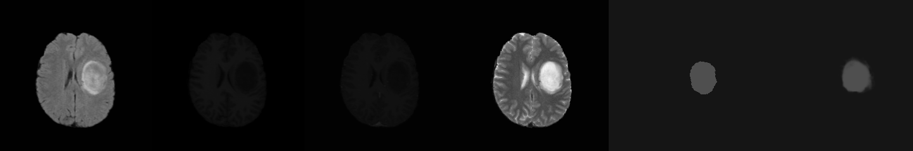

# U-Net Segmentation for BraTS-2018 Dataset

This project is modified from 

[U-Net Brain Tumor Segmentation]: https://github.com/zsdonghao/u-net-brain-tumor

#### The changes are listed below:

- Using BraTS-2018 dataset by default.
- Removed survival data processing part which is not used, and reconstruct the data loading part.
- **Important**: Using Tensorflow 1.12 and Tensorlayer 1.11.0 now. 
- **Important**: Added new method to view prediction for one image.
- Some coding style changes.

#### About the dataset

The dataset used in the project is BraTS 2018, which can be applied here:

[Dataset]: https://www.med.upenn.edu/sbia/brats2018/registration.html

Because of the license, I am not allowed to share the dataset, I only remain one MRI series in dataset folder to perform as a demo for `run.py`, contact me and I will remove that if it is not allowed.

#### About the pre-trained model weights

I trained the model on a `small` part of BraTS 2018 dataset using Nvidia Tesla V100 32GB for 100 epoches, which spent about one and a half days. I will continue training on the full dataset later.

Download link:

[Google Drive]: https://drive.google.com/file/d/1IPX5oKErah_0jumILGfNhaZMfI8v0sd-/view?usp=sharing

For Chinese users, I believe you are able to access to Google Drive(smile). 




#### The read-me document of the original project is below:

#### U-Net Brain Tumor Segmentation 

🚀：Feb 2019 the data processing implementation in this repo is not the fastest way (code need update, contribution is welcome), you can use TensorFlow dataset API instead.

This repo show you how to train a U-Net for brain tumor segmentation. By default, you need to download the training set of [BRATS 2017](http://braintumorsegmentation.org) dataset, which have 210 HGG and 75 LGG volumes, and put the data folder along with all scripts.

```bash
data
  -- Brats17TrainingData
  -- train_dev_all
model.py
train.py
...
```

### About the data
Note that according to the license, user have to apply the dataset from BRAST, please do **NOT** contact me for the dataset. Many thanks.

<div align="center">
    
    <br>  
    <em align="center">Fig 1: Brain Image</em>  
</div>


* Each volume have 4 scanning images: FLAIR、T1、T1c and T2.
* Each volume have 4 segmentation labels:

```
Label 0: background
Label 1: necrotic and non-enhancing tumor
Label 2: edema 
Label 4: enhancing tumor
```

The `prepare_data_with_valid.py` split the training set into 2 folds for training and validating. By default, it will use only half of the data for the sake of training speed, if you want to use all data, just change `DATA_SIZE = 'half'` to `all`.

### About the method

- Network and Loss: In this experiment, as we use [dice loss](http://tensorlayer.readthedocs.io/en/latest/modules/cost.html#dice-coefficient) to train a network, one network only predict one labels (Label 1,2 or 4). We evaluate the performance using [hard dice](http://tensorlayer.readthedocs.io/en/latest/modules/cost.html#hard-dice-coefficient) and [IOU](http://tensorlayer.readthedocs.io/en/latest/modules/cost.html#iou-coefficient).

- Data augmenation: Includes random left and right flip, rotation, shifting, shearing, zooming and the most important one -- [Elastic trasnformation](http://tensorlayer.readthedocs.io/en/latest/modules/prepro.html#elastic-transform), see ["Automatic Brain Tumor Detection and Segmentation Using U-Net Based Fully Convolutional Networks"](https://arxiv.org/pdf/1705.03820.pdf) for details.

<div align="center">
    
    <br>  
    <em align="center">Fig 2: Data augmentation</em>  
</div>


### Start training

We train HGG and LGG together, as one network only have one task, set the `task` to `all`, `necrotic`, `edema` or `enhance`, "all" means learn to segment all tumors.

```
python train.py --task=all
```

Note that, if the loss stick on 1 at the beginning, it means the network doesn't converge to near-perfect accuracy, please try restart it.

### Citation
If you find this project useful, we would be grateful if you cite the TensorLayer paper：

```
@article{tensorlayer2017,
author = {Dong, Hao and Supratak, Akara and Mai, Luo and Liu, Fangde and Oehmichen, Axel and Yu, Simiao and Guo, Yike},
journal = {ACM Multimedia},
title = {{TensorLayer: A Versatile Library for Efficient Deep Learning Development}},
url = {http://tensorlayer.org},
year = {2017}
}
```

